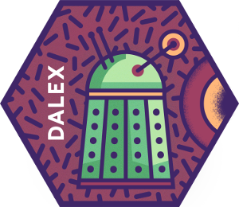
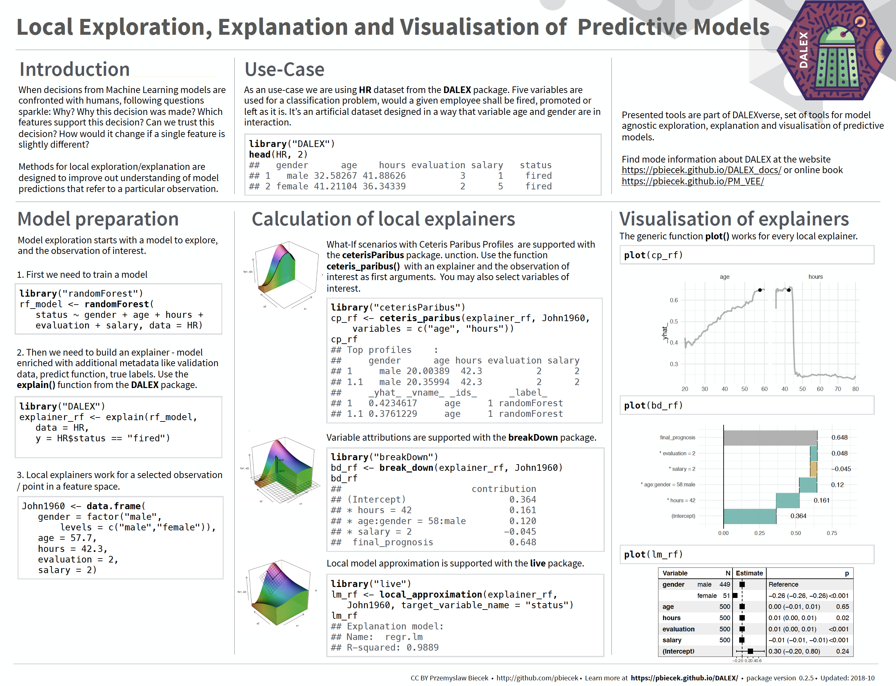

# DALEX 

[](https://cran.r-project.org/package=DALEX)
[](http://cran.rstudio.com/package=DALEX)
[](http://cranlogs.r-pkg.org/badges/grand-total/DALEX)
[](https://travis-ci.org/pbiecek/DALEX)
[](https://codecov.io/github/pbiecek/DALEX?branch=master)

## DALEX: Descriptive mAchine Learning EXplanations

Machine Learning models are widely used and have various applications in classification or regression tasks. Due to increasing computational power, availability of new data sources and new methods, ML models are more and more complex. Models created with techniques like boosting, bagging of neural networks are true black boxes. It is hard to trace the link between input variables and model outcomes. They are use because of high performance, but lack of interpretability is one of their weakest sides.

In many applications we need to know, understand or prove how input variables are used in the model and what impact do they have on final model prediction. `DALEX` is a set of tools that help to understand how complex models are working.

Find more about DALEX in this [Gentle introduction to DALEX with examples](https://pbiecek.github.io/DALEX_docs/).

Experimental Python version [pyDALEX](https://github.com/MI2DataLab/pyDALEX).

## DALEX Stories

* [An interactive notebook with examples:](https://mybinder.org/v2/gh/pbiecek/DALEX_docs/master?filepath=jupyter-notebooks%2FDALEX.ipynb) [](https://mybinder.org/v2/gh/pbiecek/DALEX_docs/master?filepath=jupyter-notebooks%2FDALEX.ipynb)

### How to use DALEX

* [How to use DALEX with caret](https://rawgithub.com/pbiecek/DALEX_docs/master/vignettes/DALEX_caret.html)
* [How to use DALEX with mlr](https://rawgithub.com/pbiecek/DALEX_docs/master/vignettes/DALEX_mlr.html)
* [How to use DALEX with H2O](https://rawgit.com/pbiecek/DALEX_docs/master/vignettes/DALEX_h2o.html)
* [How to use DALEX with xgboost package](https://rawgithub.com/pbiecek/DALEX_docs/master/vignettes/DALEX_and_xgboost.html)
* [How to use DALEX for teaching. Part 1](https://rawgithub.com/pbiecek/DALEX_docs/master/vignettes/DALEX_teaching.html)
* [How to use DALEX for teaching. Part 2](https://rawgit.com/pbiecek/DALEX_docs/master/examples/What%20they%20have%20learned%20-%20part%202.html)
* [breakDown vs lime vs shapleyR](https://rawgit.com/pbiecek/DALEX_docs/master/vignettes/Comparison_between_breakdown%2C_lime%2C_shapley.html)

### Talks about DALEX

* [Talk about DALEX at Complexity Institute / NTU February 2018](https://github.com/pbiecek/pbiecek.github.io/blob/master/Presentations/DALEX_at_NTU_2018.pdf)
* [Talk about DALEX at SER / WTU April 2018](https://github.com/pbiecek/Talks/blob/master/2018/SER_DALEX.pdf)
* [Talk about DALEX at STWUR May 2018 (in Polish)](https://github.com/STWUR/eRementarz-29-05-2018)

## Install

From CRAN

```{r}
install.packages("DALEX")
```

or from GitHub

```{r}
# dependencies
devtools::install_github("MI2DataLab/factorMerger")
devtools::install_github("pbiecek/breakDown")

# DALEX package
devtools::install_github("pbiecek/DALEX")
```

## Cheatsheets




## Single Variable


## Single Prediction


## Variable Drop-out / Importance


## Why

76 years ago Isaac Asimov devised [Three Laws of Robotics](https://en.wikipedia.org/wiki/Three_Laws_of_Robotics): 1) a robot may not injure a human being, 2) a robot must obey the orders given it by human beings and 3) A robot must protect its own existence. These laws impact discussion around [Ethics of AI](https://en.wikipedia.org/wiki/Ethics_of_artificial_intelligence). Today’s robots, like cleaning robots, robotic pets or autonomous cars are far from being conscious enough to be under Asimov’s ethics.

Today we are surrounded by complex predictive algorithms used for decision making. Machine learning models are used in health care, politics, education, judiciary and many other areas. Black box predictive models have far larger influence on our lives than physical robots. Yet, applications of such models are left unregulated despite many examples of their potential harmfulness. See *Weapons of Math Destruction* by Cathy O'Neil for an excellent overview of potential problems.

It's clear that we need to control algorithms that may affect us. Such control is in our civic rights. Here we propose three requirements that any predictive model should fulfill.

-	**Prediction's justifications**. For every prediction of a model one should be able to understand which variables affect the prediction and how strongly. Variable attribution to final prediction.
-	**Prediction's speculations**. For every prediction of a model one should be able to understand how the model prediction would change if input variables were changed. Hypothesizing about what-if scenarios.
-	**Prediction's validations** For every prediction of a model one should be able to verify how strong are evidences that confirm this particular prediction.

There are two ways to comply with these requirements. 
One is to use only models that fulfill these conditions by design. White-box models like linear regression or decision trees. In many cases the price for transparency is lower performance. 
The other way is to use approximated explainers – techniques that find only approximated answers, but work for any black box model. Here we present such techniques.


## Acknowledgments

Work on this package was financially supported by the 'NCN Opus grant 2016/21/B/ST6/02176'.
    
