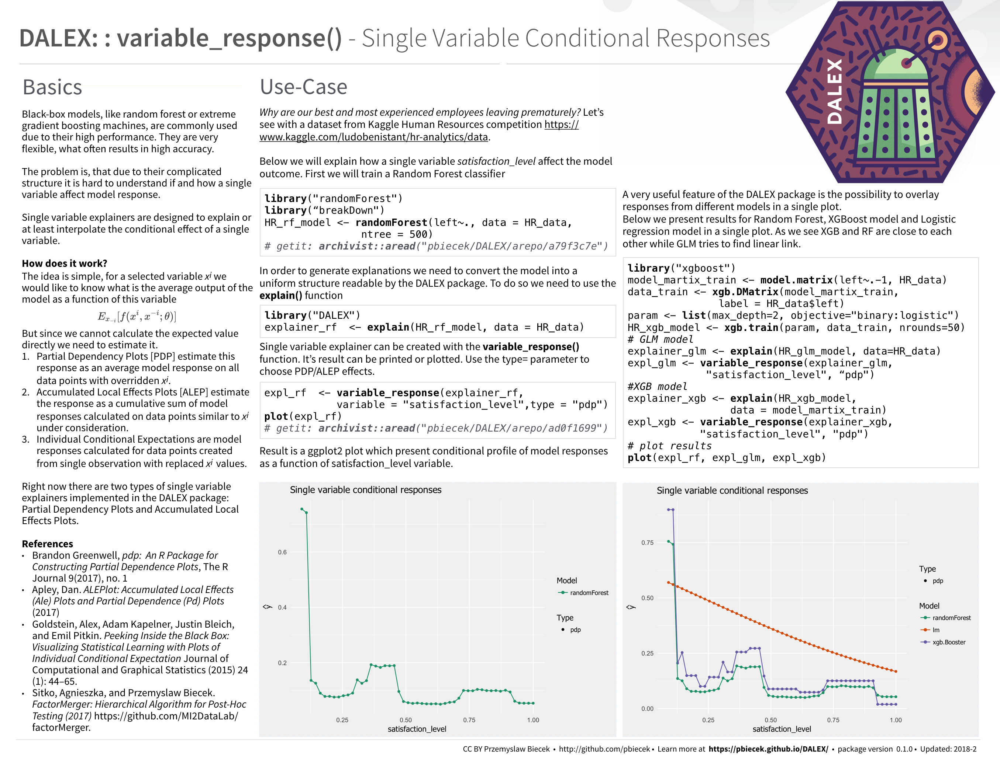
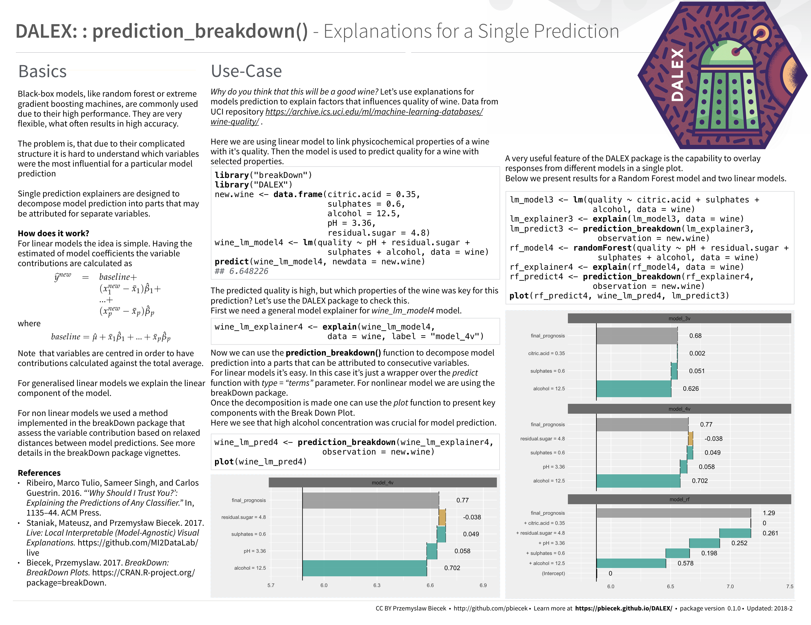
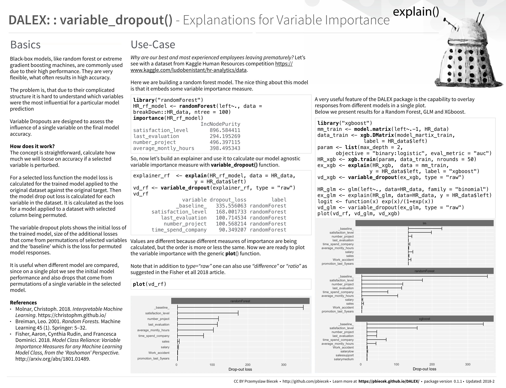

# DALEX

Descriptive mAchine Learning EXplanations

## Intro

Machine Learning models are widely used and have various applications in classification or regression tasks. Due to increasing computational power, availability of new data sources and new methods, ML models are more and more complex. Models created with techniques like boosting, bagging of neural networks are true black boxes. It is hard to trace the link between input variables and model outcomes. They are use because of high performance, but lack of interpretability is one of their weakest sides.

In many applications we need to know, understand or prove how input variables are used in the model and what impact do they have on final model prediction. DALEX is a set of tools that help to understand how complex models are working.

## Install

```{r}
# dependencies
devtools::install_github("pbiecek/breakDown")

# DALEX pacakge
devtools::install_github("pbiecek/DALEX")
```

## Single Variable



## Single Prediction



## Variable Drop-out / Importance


